# 非线性扩散问题的算子学习

## 算子学习方法：

傅里叶神经算子（FNO）与深度算子网络（DON）作为微分算子学习的代表性方法，为解决复杂物理系统的跨条件泛化难题提供了新范式。FNO基于谱域全局卷积核，通过傅里叶变换捕捉多尺度场演化的长程依赖性；DON通过隐式基函数分解与系数预测实现高维函数空间的高效映射。现有算子学习方法在线性及弱非线性场景中已展现优势，但在多尺度、强非线性问题中仍面临挑战。

本项目提出两种Fourier-DON变体架构，将FNO与DON两者结合，以学习从方程条件到特定时间点辐射扩散方程解的映射：第一类使用FNO生成基函数，并采用全连接网络处理系数；第二类则采用逐元素特征组合后接FNO解码器。相比传统数值方法（如有限元法），Fourier-DON要更加快速、准确且便于推广，能够实现复杂物理系统中的高效模拟。

## 非线性辐射扩散问题：

非线性辐射扩散问题是一类典型的多尺度强耦合输运方程，其核心在于描述辐射能量与物质能量通过光子输运产生的非线性能量交换过程。该过程的控制方程可表述为：

### 单温问题：

$$
\begin{aligned}
   & \frac{\partial E}{\partial t}-\nabla\cdot(D_L\nabla E) = 0, \quad(x,y,t)\in\Omega\times[0,1] \\
   & 0.5E+D_L\nabla E\cdot n = \beta(x,y,t), \quad(x,y,t)\in\lbrace x=0\rbrace\times[0,1] \\
   & 0.5E+D_L\nabla E\cdot n = 0, \quad(x,y,t)\in\partial\Omega\setminus\lbrace x=0\rbrace\times[0,1] \\
   & E|_{t=0} = g(x,y,0)
\end{aligned}
$$

其中 $\Omega = [0,1]\times[0,1]$ ；辐射扩散系数 $D_L$ 选用限流形式，即 $D_L = \frac{1}{3\sigma_{\alpha}+\frac{|\nabla E|}{E}}, \sigma_{\alpha} = \frac{z^3}{E^{3/4}}$ 。

### 双温问题：

$$
\begin{aligned}
   & \frac{\partial E}{\partial t} - \nabla \cdot (D_L \nabla E) = \sigma_{\alpha}(T^4 - E), \quad(x,y,t)\in\Omega\times[0,1] \\
   & \frac{\partial T}{\partial t} - \nabla \cdot (K_L \nabla T) = \sigma_{\alpha}(E - T^4), \quad(x,y,t)\in\Omega\times[0,1] \\
   & 0.5E + D_L \nabla E \cdot n = \beta(x,y,t), \quad (x,y,t) \in \lbrace x=0 \rbrace \times [0,1] \\
   & 0.5E + D_L \nabla E \cdot n = 0, \quad (x,y,t) \in \partial\Omega \setminus \lbrace x=0 \rbrace \times [0,1] \\
   & K_L \nabla T \cdot n = 0, \quad (x,y,t) \in \partial\Omega \times [0,1] \\
   & E\vert_{t=0} = g(x,y,0) \\
   & T^4\vert_{t=0} = g(x,y,0)
\end{aligned}
$$

其中 $\Omega = [0,1]\times[0,1]$ ；辐射扩散系数 $D_L, K_L$ 同样选用限流形式，即 $D_L = \frac{1}{3\sigma_{\alpha}+\frac{|\nabla E|}{E}}, \sigma_{\alpha} = \frac{z^3}{E^{3/4}}, K_L = \frac{T^4}{T^{3/2}z+T^{5/2}|\nabla T|}$ 。

对于上述单温、双温问题，材料函数 $Z$ 采用双方形，即在 $\Omega$ 内的两个0.25×0.25的方形区域中， $Z=9$ ；其他时候 $Z=1$ 。

初值条件采用常数初值，即 $g(x,y,t) = 0.01$ ；边值条件采用线性边值，即当 $t<t_1$ 时， $\beta(x,y,t)=\frac{\beta_{\text{max}}}{t_1} t$ ；当 $t\leq t_1$ 时， $\beta(x,y,t)=\beta_{\text{max}}$ 。

### 算子学习问题：

本项目需要研究的六个算子学习问题如下：

|                    | Tasks                          |
|--------------------|--------------------------------|
| single-temperature | $Z \rightarrow E$              |
|                    | $Z \times t_1 \rightarrow E$   |
|                    | $Z \times t_1 \times \beta_{\text{max}} \rightarrow E$ |
| two-temperature    | $Z \rightarrow E, T$           |
|                    | $Z \times t_1 \rightarrow E, T$ |
|                    | $Z \times t_1 \times \beta_{\text{max}} \rightarrow E, T$ |

## Fourier-DON算法设计：

本项目的目标是找一个神经网络替代模型，用于处理多输入算子 $𝒳_1\times 𝒳_2\times ... \times 𝒳_n\rightarrow 𝒴$ ，其中 $𝒳_1\times 𝒳_2\times ... \times 𝒳_n$ 表示 $n$ 个不同的输入函数空间，𝒴是输出函数空间。为此，对原始DON进行修改，使其分支网络和主干网络能分别接受离散材料函数（表示为 $Z$ ）和离散边值函数（表示为 $\xi$ ），开发了两种变体：第一类Fourier-DON和第二类Fourier-DON。

下面使用单温任务来描述两个变体。对于双温任务，只需使用两个Fourier-DON网络来学习目标函数 $𝐄,𝐓∈ℝ^{m\times m}$ 即可，其中 $m$ 表示空间维度。

### 第一类Fourier-DON：

第一类Fourier-DON的架构如下图所示，其中分支网络表示为 $B_\theta$ ，主干网络表示为 $T_\theta$ 。

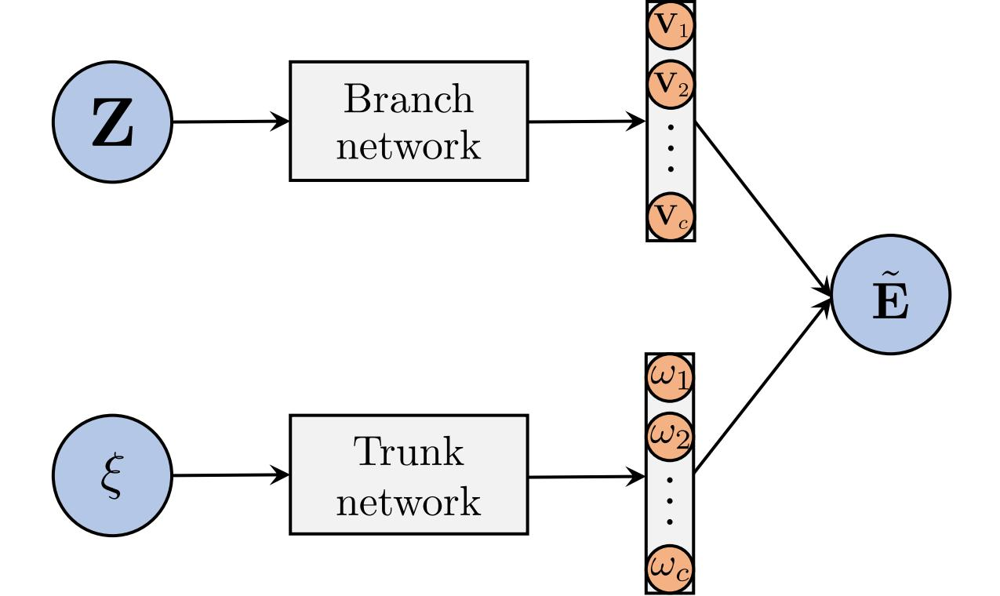

将材料函数𝐙缩放到范围(0,1)，并与相应的二维网格坐标 $X,Y∈ℝ^{m\times m}$ 拼接，形成 $[Z,X,Y]∈ℝ^{m\times m\times 3}$ ，作为分支网络的输入层。再将边值函数的参数 $t_1∈ℝ$ 和 $\beta_{\text{max}}∈ℝ$ 也缩放到(0,1)，并拼接成 $[t_1,\beta_{\text{max}}]∈ℝ^2$ ，作为主干网络的输入层。

分支网络首先由一个线性层组成，该层将 $ℝ^{m\times m\times 3}$ 映射到 $ℝ^{m\times m\times 32}$ ；随后是四个Fourier层，每层包含12个模式和32个通道，层内的逐点变换块实现为一个两层FCN，每层有32个隐藏单元。主干网络设置为一个四层FCN，每层有32个隐藏单元。GeLU激活函数应用于除最后一层外两个网络的所有层。

分支和主干网络的输出为：

$$
\begin{aligned}
   & 𝐕 = B_\theta (𝐙)∈ℝ^{m\times m\times c}, \\
   & 𝛚 = T_\theta (\xi)∈ℝ^c,
\end{aligned}
$$

其中 $c$ 是通道数，𝐕可以看成一列基函数 $[𝐕_1,...,𝐕_c]$ ，𝛚可以看成一列系数 $[𝛚_1,...,𝛚_c]$ 。对于有固定边值函数的任务，可以省略主干网络。

离散化的目标函数 $𝐄∈ℝ^{m\times m}$ 近似为：

$$
\begin{equation}
   𝐄̃ = \sum_i 𝛚_i 𝐕_i.
\end{equation}
$$

损失函数定义为相对 $\ell_2$ 范数误差：

$$
\begin{equation}
   L = \frac{1}{N} \sum_{k=1}^N \frac{‖𝐄^{(k)}-𝐄̃^{(k)}‖₂}{‖𝐄^{(k)}‖₂},
\end{equation}
$$

其中 $N$ 表示样本数， $𝐄^{(k)}$ 是第 $k$ 个FEM参考解， $𝐄̃^{(k)}$ 是神经网络的相应预测。

以任务 $Z \times t_1 \times \beta_{\text{max}} \rightarrow E$ 为例，第一类Fourier-DON的具体训练过程如下图所示：

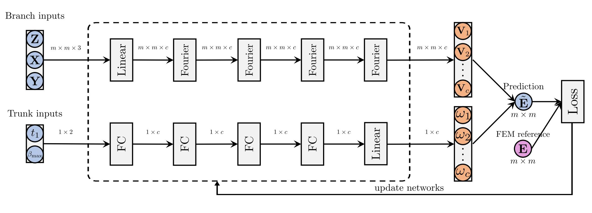

### 第二类Fourier-DON：

第二类Fourier-DON的架构如下图所示，解码器表示为 $\Phi_\theta$ 。

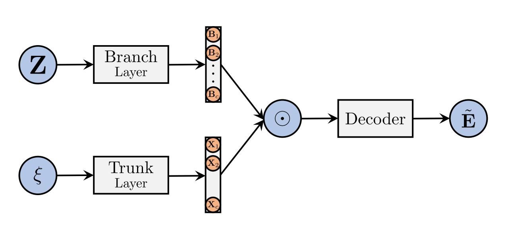

分支网络和主干网络的输入层与第一类中的相同。

分支网络和主干网络均通过一个线性层实现，该层将 $ℝ^{m\times m\times 3}$ 映射到 $ℝ^{m\times m\times 32}$ ，然后进行逐元素乘法。将输出 $𝐕∈ℝ^{m\times m\times 32}$ 送入一个FNO解码器，该解码器包含四个Fourier层（每个层与第一类中的相同）以及一个包含32个隐藏单元的两层FCN。

离散化的目标函数 $𝐄∈ℝ^{m\times m}$ 近似为：

$$
\begin{aligned}
   & 𝐁 = B_\theta (𝐙)∈ℝ^{m\times m\times c}, \\
   & 𝐗 = T_\theta (\xi)∈ℝ^c, \\
   & 𝐕_{i,j} = 𝐁_{i,j}⊙𝐗, \\
   & 𝐄̃ = \Phi_\theta (𝐕^{(0)})
\end{aligned}
$$

其中 $i,j∈[0,m-1]$ 表示𝐁和𝐕的空间索引，⊙表示逐元素乘积。对于具有固定边值函数 $\beta(x,y,t)$ 的任务，可以省略主干网络。

损失函数定义与第一类中的相同。

以任务 $Z \times t_1 \times \beta_{\text{max}} \rightarrow E$ 为例，第二类Fourier-DON的具体训练过程如下图所示：


## 代码介绍：

该存储库包含脚本，以重现有关算子学习的论文结果，以解决非线性扩散问题。请按照以下说明进行设置，以设置项目，运行实验和过程结果。

对于单温问题，取129×129的网格点，设置时间步长为0.001，皮卡迭代至收敛极限为0.001或迭代100步，将有限元法求出的结果作为参考解。对于双温问题，取257×257的网格点，设置时间步长为0.001，皮卡迭代至收敛极限为0.01或迭代100步，将有限元法求出的结果作为参考解。

输入还包括随机采样的 $Z,t_1,\beta_{\text{max}}$ 。参数 $Z$ 的两个方形区域左下角坐标从(0,1)中随机采样，参数 $t_1$ 在[0,1]中随机采样，参数 $\beta_{\text{max}}$ 在[9,11]中随机采样，用于构建源函数 $\beta(x,y,t)$ 。对于仅以 $Z$ 为输入的任务，设 $t_1=0.5,\beta_{\text{max}}=10$ ；对于仅以 $Z,t_1$ 为输入的任务，设 $\beta_{\text{max}}=10$ 。

两类变体算子均使用Adam优化器，利用小批量梯度下降进行优化。采用余弦退火调度器，设置初始学习率为0.001，训练周期为100个，批次大小为4个。默认训练样本为600个，测试样本为100个。

### 项目结构：
   
```
operator_learning-nonlinear_diffusion/
├── dataset/
│   ├── nd/
│   └── nd_seq/
├── result/
│   ├── exps/
│   ├── seq_exps/
│   ├── figs/
│   └── result_process.py
├── src/
│   ├── train.py
│   ├── nets.py
│   ├── utils.sh
│   ├── default_exps.sh
│   ├── nlayer_exps.sh
│   ├── ntrain_exps.sh
│   ├── modes_exps.sh
│   ├── width_exps.sh
│   ├── superres_exps.sh
│   └── seq_exps.sh
├── requirements.txt
└── README.md
```

### 参数设置：

|参数      |说明      |默认值      |
|:--------:|:--------:|:--------:|
|data-root    |数据集根目录路径（"../dataset/nd/"或"../dataset/nd_seq/"）        |../dataset/nd/       |
|task         |任务名称（例："heat-1T-zsquares", "heat-2T-zsquares-t1-bmax"）    |heat-1T-zsquares     |
|num-train   |训练样本数量                      |600          |
|num-test    |测试样本数量                      |100          |
|batch-size  |训练批次大小                      |4            |
|seed        |随机种子（用于结果复现）            |0           |
|lr          |初始学习率                        |1e-3         |
|epochs      |训练周期数                        |100          |
|modes       |x和y方向的Fourier模数               |12           |
|width       |网络通道数                        |32           |
|grid-size   |空间网格分辨率                     |129          |
|output-dir  |训练结果保存目录                   |../result/   |
|num-branch  |分支层数（Fourier层）              |4            |
|num-trunk   |主干层数（FDON2d的线性层）         |2            |
|device      |GPU设备ID                         |0            |
|ratio       |空间采样率（1、2或4）              |1            |
|arch        |模型架构（"fno", "fdon1"或"fdon2"）|fno          |

### 配置准备：

- 一个配备兼容GPU的系统（需确保可用的有效GPU设备ID）

- 已安装Python（版本需与依赖项兼容，例如Python 3.8+）及Bash环境

- 需安装`requirements.txt`中列出的Python依赖项（如`torch`、`numpy`、`scipy`、`matplotlib`）

- 确保安装支持GPU的Pytorch版本

- 可访问数据集及结果文件（下载链接如下）

### 设置：

1. **下载数据集以及结果**：
   - 从[https://pan.baidu.com/s/1CEs6UBiWCt3dzjk-vs98og?pwd=nrde](https://pan.baidu.com/s/1CEs6UBiWCt3dzjk-vs98og?pwd=nrde)访问数据集和结果
   - 解压`dataset.zip`和`result.zip`文件
   - 根据上述项目结构，将提取的`dataset/`和`result/`文件夹放在根目录中
  
2. **验证项目结构**：
   - 确保项目目录与上述结构匹配，包括`requirements.txt`文件

3. **安装依赖项**：
   - 创建虚拟环境（建议避免冲突）：
     ```bash
     python -m venv env
     source env/bin/activate  # On Windows: env\Scripts\activate
     ```
   - 安装`requirements.txt`中列出的依赖项：
     ```bash
     pip install -r requirements.txt
     ```

### 运行实验：

1. 进入`src/`目录：
   ```bash
   cd src
   ```

2. 执行目标脚本，并指定GPU设备ID（例如：`0`、`1`）：
   ```bash
   bash <script_name>.sh device=<ID>
   ```
   示例：
   ```bash
   bash default_exps.sh device=0
   ```

3. 按需对其他脚本重复上述操作（如`default_exps.sh`，`nlayer_exps.sh`等）

#### 使用`train.py`脚本：

`train.py`用于训练和评估傅里叶神经算子模型（`FNO2d`、`FDON2d`、`FDON2d_II`），支持热扩散等任务。

**核心功能**
- **训练**：使用L2损失、Adam优化器和余弦退火学习率调度。支持`FNO2d`（输入：初值条件）和`FDON2d`/`FDON2d_II`（输入：初边值条件）。
- **推理**：计算测试预测、相对L2损失和推理时间（GPU/CPU）。
- **输出**：模型权重、预测结果、损失曲线和推理时间保存至`../result/<task>/<component>/`。

**命令示例**
```bash
python train.py --task heat-1T-zsquares --arch fno --num-train 600 --num-test 100 --batch-size 4 --device 0
```

### 结果处理：

完成所有实验后，对结果进行处理以生成最终表格和图表：

1. 进入`result/`目录：
   ```bash
   cd result
   ```

2. 运行结果处理脚本：
   ```bash
   python result_process.py
   ```

该脚本会汇总实验输出数据，并生成与论文中表格和图表对应的结果。

各脚本所对应的论文中的特定表格和图像结果如下表：

| 脚本                  | 对应的结果                                |
|-----------------------|-------------------------------------------|
| `default_exps.sh`     | Table II, Table III, Table IV, Fig. 7, Fig. 8 |
| `nlayer_exps.sh`      | Fig. 9                                   |
| `ntrain_exps.sh`      | Fig. 9                                   |
| `modes_exps.sh`       | Fig. 9                                   |
| `width_exps.sh`       | Fig. 9                                   |
| `superres_exps.sh`    | Table V                                  |
| `seq_exps.sh`         | Fig. 10, Table VI                        |

## 数值实验：

### 精度及效率实验：

对于固定边值函数的任务， $\ell_2$ 相对误差如下：

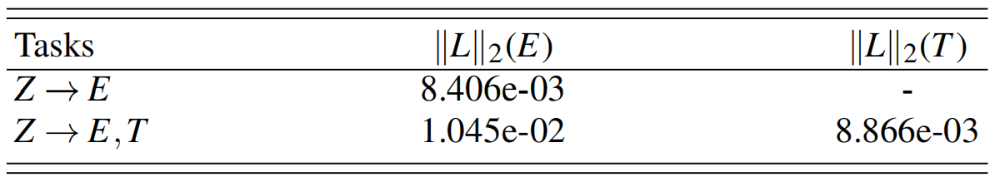

对于非固定边值函数的任务， $\ell_2$ 相对误差如下：

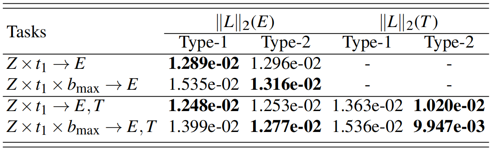

全部算子学习任务的计算效率如下：

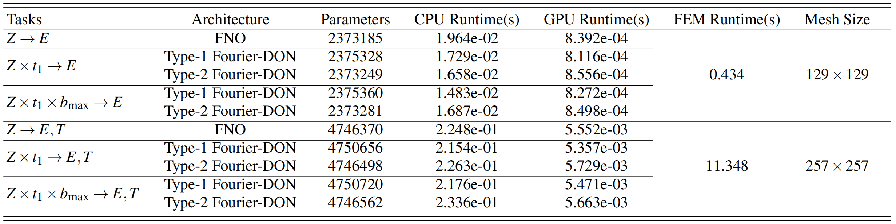

默认设置下全部算子学习任务的训练动态如下：


以任务 $Z \times t_1 \times \beta_{\text{max}} \rightarrow E, T$ 为例，参考解、两类Fourier-DON以及绝对误差的可视化如下：

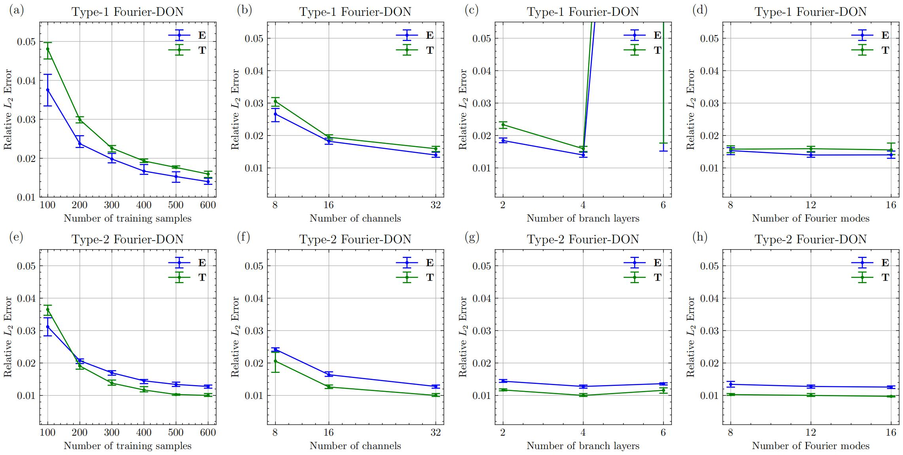

### 消融实验：

以任务 $Z \times t_1 \times \beta_{\text{max}} \rightarrow E, T$ 为例，不同训练样本数量、Fourier层数、Fourier层通道数以及Fourier模数对精度的影响如下：

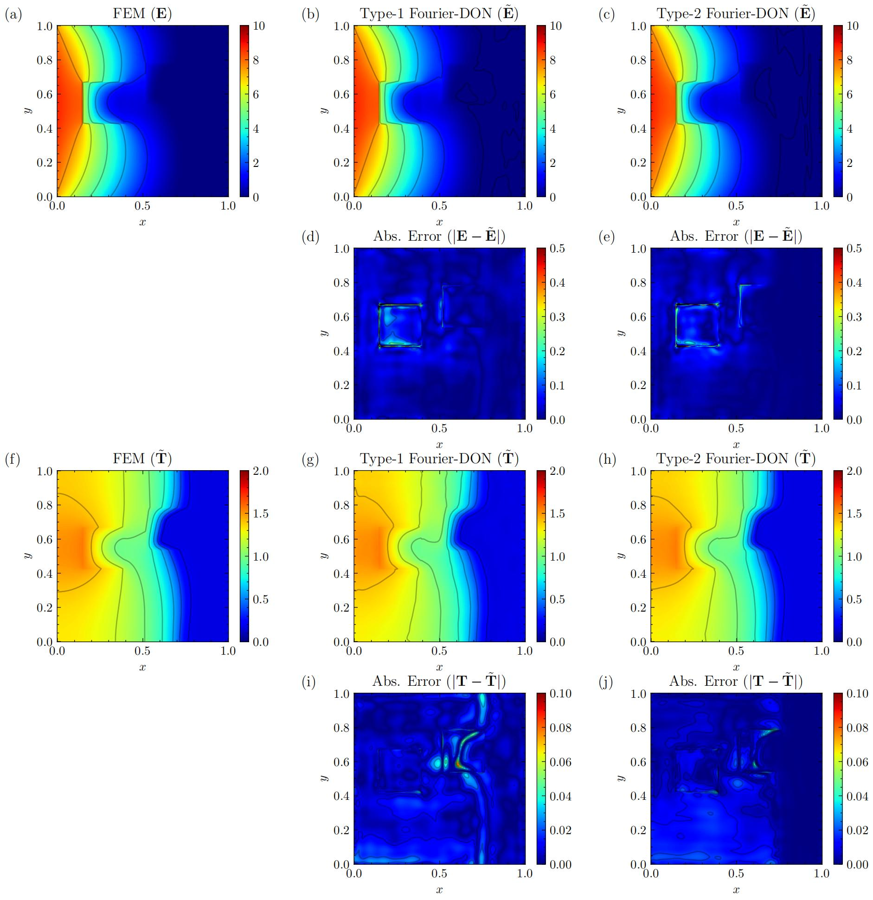

### 泛化能力实验：

#### 超分辨率泛化：

考虑任务 $Z \times t_1 \times \beta_{\text{max}} \rightarrow E, T$ ，不同训练数据分辨率对精度的影响如下：

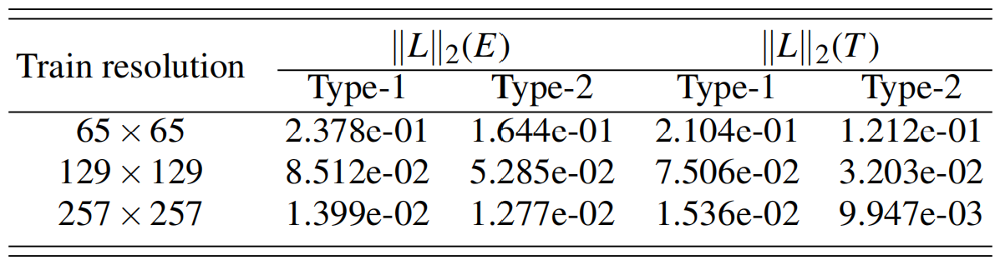

#### 时间泛化：

考虑任务 $Z \times t_1 \times \beta_{\text{max}} \rightarrow E$ ，不同时刻 $\tau$ 下两类Fourier-DON的 $\ell_2$ 相对误差如下：

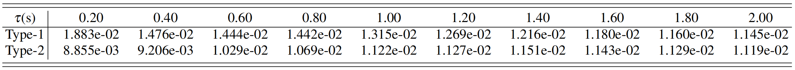

不同时刻 $\tau$ 下参考解、两类Fourier-DON结果以及绝对误差可视化如下：

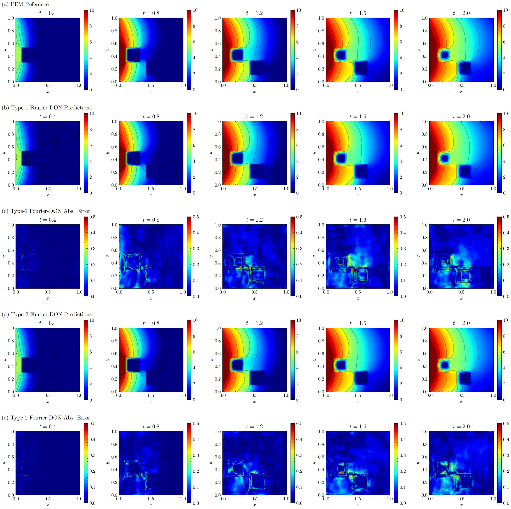

## 故障排除：

- **GPU错误**：验证GPU设备ID，并确保CUDA驱动程序与`requirements.txt`中的`torch`版本兼容
- **依赖缺失**：若出现错误，请确保已安装`requirements.txt`中列出的所有依赖包，并参考论文检查额外要求
- **结果不完整**：在处理结果前，确保所有实验均已成功运行。
- **文件结构问题**：确认`dataset/`、`result/`和`requirements.txt`文件路径正确
- **任务错误**: 仅使用`train.py`中列出的支持任务（如`heat-1T-zsquares`）

## 补充说明：

- `result_process.py`脚本默认所有实验均已成功完成
- 实验详细说明及预期输出请参考论文
- 进行大规模实验时，请监控系统资源以避免崩溃

-----------------------------------------------------------------------------------------------------------------------------------------------------------------------------
# Operator Learning for Nonlinear Diffusion Problems

This repository contains scripts to reproduce the results from the paper on operator learning for solving nonlinear diffusion problems. Follow the instructions below to set up the project, run experiments, and process results.

## Project Structure

```
operator_learning-nonlinear_diffusion/
├── dataset/
│   ├── nd/
│   └── nd_seq/
├── result/
│   ├── exps/
│   ├── seq_exps/
│   ├── figs/
│   └── result_process.py
├── src/
│   ├── train.py
│   ├── nets.py
│   ├── utils.sh
│   ├── default_exps.sh
│   ├── nlayer_exps.sh
│   ├── ntrain_exps.sh
│   ├── modes_exps.sh
│   ├── width_exps.sh
│   ├── superres_exps.sh
│   └── seq_exps.sh
├── requirements.txt
└── README.md
```

## Prerequisites

- A system with a compatible GPU (ensure valid GPU device IDs are available).
- Python (version compatible with dependencies, e.g., Python 3.8+) and Bash installed.
- Required Python dependencies listed in `requirements.txt` (e.g., `torch`, `numpy`, `scipy`, `matplotlib`).
- Ensure Pytorch installed with GPU support.
- Access to the dataset and results (download link below).

## Setup

1. **Download Dataset and Results**:
   - Access the dataset and results at: [https://pan.baidu.com/s/1CEs6UBiWCt3dzjk-vs98og?pwd=nrde](https://pan.baidu.com/s/1CEs6UBiWCt3dzjk-vs98og?pwd=nrde).
   - Unzip `dataset.zip` and `result.zip`.
   - Place the extracted `dataset/` and `result/` folders in the root directory as shown in the project structure.

2. **Verify Project Structure**:
   - Ensure the project directory matches the structure above, including the `requirements.txt` file.

3. **Install Dependencies**:
   - Create a virtual environment (recommended to avoid conflicts):
     ```bash
     python -m venv env
     source env/bin/activate  # On Windows: env\Scripts\activate
     ```
   - Install dependencies from `requirements.txt`:
     ```bash
     pip install -r requirements.txt
     ```

## Running Experiments

The following scripts generate results for specific tables and figures in the paper:

| Script                | Generates Results For                     |
|-----------------------|-------------------------------------------|
| `default_exps.sh`     | Table II, Table III, Table IV, Fig. 7, Fig. 8 |
| `nlayer_exps.sh`      | Fig. 9                                   |
| `ntrain_exps.sh`      | Fig. 9                                   |
| `modes_exps.sh`       | Fig. 9                                   |
| `width_exps.sh`       | Fig. 9                                   |
| `superres_exps.sh`    | Table V                                  |
| `seq_exps.sh`         | Fig. 10, Table VI                        |

### Steps to Run Experiments

1. Navigate to the `src/` directory:
   ```bash
   cd src
   ```

2. Execute the desired script, specifying the GPU device ID (e.g., `0`, `1`):
   ```bash
   bash <script_name>.sh device=<ID>
   ```
   Example:
   ```bash
   bash default_exps.sh device=0
   ```

3. Repeat for each script as needed (`default_exps.sh`, `nlayer_exps.sh`, etc.).

### Using the `train.py` Script

The `train.py` script trains and performs inference with Fourier Neural Operator models (`FNO2d`, `FDON2d`, `FDON2d_II`) for tasks like heat diffusion. 

**Key Features**:
- **Training**: Trains models using L2 loss, Adam optimizer, and cosine annealing learning rate scheduling. Supports `FNO2d` (input: initial conditions) and `FDON2d`/`FDON2d_II` (inputs: initial conditions and boundary conditions).
- **Inference**: Computes test predictions, relative L2 loss, and inference times (GPU/CPU).
- **Output**: Saves model weights, predictions, loss dynamics, and inference times to `../result/<task>/<component>/`.

**Command Example**:
```bash
python train.py --task heat-1T-zsquares --arch fno --num-train 600 --num-test 100 --batch-size 4 --device 0
```

**Key Arguments**:
- `--task`: Task name (e.g., `heat-1T-zsquares`, `heat-1T-zsquares-t1`).
- `--arch`: Model architecture (`fno`, `fdon1`, `fdon2`).
- `--num-train`/`--num-test`: Number of training/test samples.
- `--batch-size`: Batch size for training.
- `--device`: GPU device ID.
- `--epochs`: Number of training epochs (default: 100).
- `--lr`: Learning rate (default: 1e-3).
- `--modes`/`--width`: Fourier modes and network channels.
- Full list available via `python train.py --help`.

## Processing Results

After completing all experiments, process the results to generate the final tables and figures:

1. Navigate to the `result/` directory:
   ```bash
   cd result
   ```

2. Run the result processing script:
   ```bash
   python result_process.py
   ```

This script aggregates experiment outputs and produces the results corresponding to the paper’s tables and figures.

## Troubleshooting

- **GPU Errors**: Verify the GPU device ID and ensure CUDA drivers are compatible with the `torch` version in `requirements.txt`.
- **Missing Dependencies**: If errors occur, ensure all packages in `requirements.txt` are installed. Check the paper for additional requirements.
- **Incomplete Results**: Ensure all experiments have run successfully before processing results.
- **File Structure Issues**: Confirm `dataset/`, `result/`, and `requirements.txt` are correctly placed.
- **Task Errors**: Use supported tasks (e.g., `heat-1T-zsquares`) as listed in `train.py`.

## Additional Notes

- The `result_process.py` script assumes all experiments have completed successfully.
- Refer to the paper for detailed experiment descriptions and expected outputs.
- For large-scale experiments, monitor system resources to prevent crashes.
