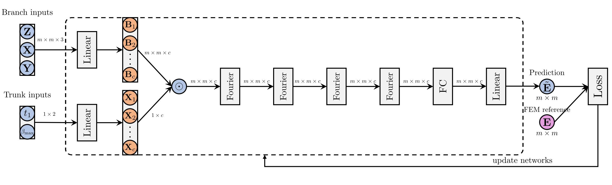
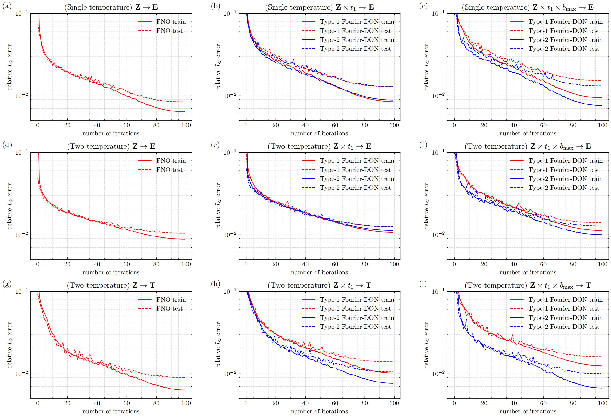

# 非线性辐射扩散问题的端到端神经算子代理模型的构建

## 研究目标：

鉴于许多复杂实际应用场景对计算效率的迫切需求，需要在模型泛化能力层面实现突破。因此，本项目旨在构建神经算子，以直接学习从材料函数和边值条件到解场的端到端映射。基于此目标，本项目将探索辐射扩散方程通用求解器的构建。为此，本项目融合傅里叶神经算子（Fourier Neural Operator，FNO）与深度算子网络（Deep Operator Network，DON）的优势，提出两种新的端到端神经算子代理模型Fourier-DON，用于学习材料分布属性和边值条件到特定时刻方程解的映射关系，实现对辐射能量密度和材料温度的预测，并测试评估模型的准确性和泛化性。

## 问题描述：

非线性辐射扩散问题是一类典型的多尺度强耦合输运方程，其核心在于描述辐射能量与物质能量通过光子输运产生的非线性能量交换过程。该过程的控制方程可表述为：

### 单温问题：

$$
\begin{aligned}
   & \frac{\partial E}{\partial t}-\nabla\cdot(D_L\nabla E) = 0, \quad(x,y,t)\in\Omega\times[0,1] \\
   & 0.5E+D_L\nabla E\cdot n = \beta(x,y,t), \quad(x,y,t)\in\lbrace x=0\rbrace\times[0,1] \\
   & 0.5E+D_L\nabla E\cdot n = 0, \quad(x,y,t)\in\partial\Omega\setminus\lbrace x=0\rbrace\times[0,1] \\
   & E|_{t=0} = g(x,y,0)
\end{aligned}
$$

其中 $\Omega = [0,1]\times[0,1]$ ；辐射扩散系数 $D_L$ 选用限流形式，即 $D_L = \frac{1}{3\sigma_{\alpha}+\frac{|\nabla E|}{E}}, \sigma_{\alpha} = \frac{z^3}{E^{3/4}}$ 。

### 双温问题：

$$
\begin{aligned}
   & \frac{\partial E}{\partial t} - \nabla \cdot (D_L \nabla E) = \sigma_{\alpha}(T^4 - E), \quad(x,y,t)\in\Omega\times[0,1] \\
   & \frac{\partial T}{\partial t} - \nabla \cdot (K_L \nabla T) = \sigma_{\alpha}(E - T^4), \quad(x,y,t)\in\Omega\times[0,1] \\
   & 0.5E + D_L \nabla E \cdot n = \beta(x,y,t), \quad (x,y,t) \in \lbrace x=0 \rbrace \times [0,1] \\
   & 0.5E + D_L \nabla E \cdot n = 0, \quad (x,y,t) \in \partial\Omega \setminus \lbrace x=0 \rbrace \times [0,1] \\
   & K_L \nabla T \cdot n = 0, \quad (x,y,t) \in \partial\Omega \times [0,1] \\
   & E\vert_{t=0} = g(x,y,0) \\
   & T^4\vert_{t=0} = g(x,y,0)
\end{aligned}
$$

其中 $\Omega = [0,1]\times[0,1]$ ；辐射扩散系数 $D_L, K_L$ 同样选用限流形式，即 $D_L = \frac{1}{3\sigma_{\alpha}+\frac{|\nabla E|}{E}}, \sigma_{\alpha} = \frac{z^3}{E^{3/4}}, K_L = \frac{T^4}{T^{3/2}z+T^{5/2}|\nabla T|}$ 。

### 算子学习任务：

对于上述单温、双温问题，材料函数 $z$ 采用双方形，即在 $\Omega$ 内的两个0.25×0.25的方形区域中， $z=9$ ；其他时候 $z=1$ 。默认设置这两个方形区域左下角的坐标分别为 $(\frac{3}{16},\frac{9}{16}),(\frac{9}{16},\frac{3}{16})$ 。

初值条件采用常数初值，即 $g(x,y,t) = 0.01$ ；边值条件采用线性边值，即当 $t<t_1$ 时， $\beta(x,y,t)=\frac{\beta_{\text{max}}}{t_1} t$ ；当 $t\leq t_1$ 时， $\beta(x,y,t)=\beta_{\text{max}}$ 。默认设置 $t_1=0.5,\beta_{\text{max}}=10$ 。

本项目需要研究的六个算子学习任务如下：

|                    | 任务                           |
|--------------------|--------------------------------|
| 单温               | $z \rightarrow E$              |
|                    | $z \times t_1 \rightarrow E$   |
|                    | $z \times t_1 \times \beta_{\text{max}} \rightarrow E$ |
| 双温               | $z \rightarrow E, T$           |
|                    | $z \times t_1 \rightarrow E, T$ |
|                    | $z \times t_1 \times \beta_{\text{max}} \rightarrow E, T$ |

## 算法设计：

本项目的目标是构建一个神经网络替代模型，用于处理多输入算子 $𝒳_1\times 𝒳_2\rightarrow 𝒴$ ，其中 $𝒳_1$ 表示材料函数 $z$ 的函数空间， $𝒳_2$ 表示边值条件 $\beta$ 的函数空间，𝒴表示目标函数空间。

针对边值条件固定的辐射扩散问题，我们直接采用FNO框架求解，在Fourier层之后增加了一个额外的线性层，直接将输出映射到解空间。而对于非固定边值条件的辐射扩散问题，本项目创新性地设计了两种端到端神经算子代理模型Fourier-DON。下面将以单温问题为例展开说明。对于双温问题，可构建两个并行网络分支分别学习辐射能量密度𝐄与材料温度𝐓。

### Type-1 Fourier-DON算法设计：

Type-1 Fourier-DON的架构如下图所示，其中分支网络表示为 $B_\theta$ ，主干网络表示为 $T_\theta$ 。该方法结合了FNO和DON的优势，分支网络通过Fourier层学习基函数，并在主干网络中以全连接网络学习对应系数，以基函数与系数的线性组合生成预测解。


将材料函数 $z$ 缩放到范围(0,1)，并与相应的二维网格坐标 $x,y∈ℝ^{m\times m}$ 拼接，形成 $𝐙=[z,x,y]∈ℝ^{m\times m\times 3}$ ，作为分支网络的输入层，其中 $m$ 表示空间维度。再将边值函数的参数 $t_1∈ℝ$ 和 $\beta_{\text{max}}∈ℝ$ 也缩放到(0,1)，并拼接成 $[t_1,\beta_{\text{max}}]∈ℝ^2$ ，作为主干网络的输入层。

分支网络首先由一个线性层组成，该层将 $ℝ^{m\times m\times 3}$ 映射到 $ℝ^{m\times m\times 32}$ ；随后是四个Fourier层，每层包含12个模式和32个通道，层内的逐点变换块实现为一个两层FCN，每层有32个隐藏单元。主干网络设置为一个四层FCN，每层有32个隐藏单元。除最后一层外，两个网络所有层的激活函数均选为GeLU函数。

对于具有固定边值条件的任务，FNO网络可以视为省略了主干网络、分支网络在Fourier层之后增加了一个额外线性层将输出映射到解空间的Type-1 Fourier-DON。

分支和主干网络的输出为：

$$
\begin{aligned}
   & 𝐕 = B_\theta (𝐙)∈ℝ^{m\times m\times c}, \\
   & 𝛚 = T_\theta (\xi)∈ℝ^c,
\end{aligned}
$$

其中 $c$ 是通道数，𝐕可以看成一列基函数 $[𝐕_1,...,𝐕_c]$ ，𝛚可以看成一列系数 $[𝛚_1,...,𝛚_c]$ 。对上述两个输出进行线性组合得到最终输出：

$$
\begin{equation}
   𝐄̃ = \sum_i 𝛚_i 𝐕_i.
\end{equation}
$$

其中𝐄̃表示由神经网络预测得到的目标函数，通过最小化网络输出与数值参考解的相对 $L_2$ 误差损失函数 $L=\frac{‖𝐄-𝐄̃‖₂}{‖𝐄‖₂}$ ，尽可能逼近真实目标函数 $𝐄∈ℝ^{m\times m}$ 。

以任务 $z \times t_1 \times \beta_{\text{max}} \rightarrow E$ 为例，Type-1 Fourier-DON的具体训练过程如下图所示：


### Type-2 Fourier-DON：

Type-2 Fourier-DON的架构如下图所示，解码器表示为 $\Phi_\theta$ 。该算子也结合了FNO和DON的优势，采用编码器-解码器结构，通过全连接层分别将材料函数和边值条件参数投影到特征空间，将主干网络与分支网络的输出进行逐点内积后输入FNO解码器生成最终解。


分支网络和主干网络的输入处理与Type-1模型的处理相同。

分支网络和主干网络均通过一个线性层实现，该层将 $ℝ^{m\times m\times 3}$ 映射到 $ℝ^{m\times m\times 32}$ ，然后进行逐元素乘法。将输出 $𝐕∈ℝ^{m\times m\times 32}$ 送入一个FNO解码器，该解码器包含四个Fourier层（每个层与第一类中的相同）以及一个包含32个隐藏单元的两层FCN。

离散化的目标函数 $𝐄∈ℝ^{m\times m}$ 近似为：

$$
\begin{aligned}
   & 𝐁 = B_\theta (𝐙)∈ℝ^{m\times m\times c}, \\
   & 𝐗 = T_\theta (\xi)∈ℝ^c, \\
   & 𝐕_{i,j} = 𝐁_{i,j}⊙𝐗, \\
   & 𝐄̃ = \Phi_\theta (𝐕^{(0)})
\end{aligned}
$$

其中 $i,j∈[0,m-1]$ 表示𝐁和𝐕的空间索引，⊙表示逐元素乘积。损失函数同样设置为相对 $L_2$ 误差式。

以任务 $z \times t_1 \times \beta_{\text{max}} \rightarrow E$ 为例，Type-2 Fourier-DON的具体训练过程如下图所示：



## 代码介绍：

### 项目结构：
   
```
operator_learning-nonlinear_diffusion/
├── dataset/
│   ├── nd/
│   └── nd_seq/
├── result/
│   ├── exps/
│   ├── seq_exps/
│   ├── figs/
│   └── result_process.py
├── src/
│   ├── train.py
│   ├── nets.py
│   ├── utils.sh
│   ├── default_exps.sh
│   ├── nlayer_exps.sh
│   ├── ntrain_exps.sh
│   ├── modes_exps.sh
│   ├── width_exps.sh
│   ├── superres_exps.sh
│   └── seq_exps.sh
├── requirements.txt
└── README.md
```

### 参数设置：

|参数      |说明      |默认值      |
|:--------:|:--------:|:--------:|
|data-root    |数据集根目录路径（`../dataset/nd/`或`../dataset/nd_seq/`）        |`../dataset/nd/`       |
|task         |任务名称（例：`heat-1T-zsquares`, `heat-2T-zsquares-t1-bmax`）   |`heat-1T-zsquares`     |
|num-train   |训练样本数量                      |600          |
|num-test    |测试样本数量                      |100          |
|batch-size  |训练批次大小                      |4            |
|seed        |随机种子（用于结果复现）            |0           |
|lr          |初始学习率                        |1e-3         |
|epochs      |训练周期数                        |100          |
|modes       | $x$ 和 $y$ 方向的Fourier模数               |12           |
|width       |网络通道数                        |32           |
|grid-size   |空间网格分辨率                     |129          |
|output-dir  |训练结果保存目录                   |`../result/`   |
|num-branch  |分支层数（Fourier层）              |4            |
|num-trunk   |主干层数（Type-1 Fourier-DON的线性层）         |2            |
|device      |GPU设备ID                         |0            |
|ratio       |空间采样率（1、2或4）              |1            |
|arch        |模型架构（`fno`, `fdon1`或`fdon2`）|`fno`          |

### 运行环境：

**硬件**：

- GPU: NVIDIA GPU

**软件环境**：

- Python 版本: Python 3.11.3

- Shell 环境: Bash

**Python 依赖项**：

- h5py==3.10.0

- torch==2.3.1

- numpy==2.2.5

- scipy==1.15.3

- matplotlib==3.10.3

- pandas==2.2.3

- SciencePlots==2.1.1

### 环境配置：

1. **下载数据集以及结果**：
   - 从[https://pan.baidu.com/s/1CEs6UBiWCt3dzjk-vs98og?pwd=nrde](https://pan.baidu.com/s/1CEs6UBiWCt3dzjk-vs98og?pwd=nrde)访问数据集和结果
   - 解压`dataset.zip`和`result.zip`文件
   - 根据上述项目结构，将提取的`dataset/`和`result/`文件夹放在根目录中
  
2. **验证项目结构**：
   - 确保项目目录与上述项目结构匹配，包括`requirements.txt`文件

3. **安装依赖项**：
   - 创建虚拟环境（建议避免冲突）：
     ```bash
     python -m venv env
     source env/bin/activate  # On Windows: env\Scripts\activate
     ```
   - 安装`requirements.txt`中列出的依赖项：
     ```bash
     pip install -r requirements.txt
     ```

### 运行实验：

#### 使用脚本（如`default_exps.sh`，`nlayer_exps.sh`等）：

1. 进入`src/`目录：
   ```bash
   cd src
   ```

2. 在多GPU设备上，可以指定具体的GPU设备来执行目标脚本：
   ```bash
   bash <script_name>.sh device=<ID>
   ```
   示例：
   ```bash
   bash default_exps.sh device=0
   ```

3. 按需对其他脚本重复上述操作

#### 使用`train.py`脚本：

命令示例：
```bash
python train.py --task heat-1T-zsquares --arch fno --num-train 600 --num-test 100 --batch-size 4 --device 0
```

### 结果处理：

完成所有实验后，对结果进行处理以生成最终表格和图表：

1. 进入`result/`目录：
   ```bash
   cd result
   ```

2. 运行结果处理脚本：
   ```bash
   python result_process.py
   ```

### 故障排除：

- **GPU错误**：验证GPU设备ID，并确保CUDA驱动程序与`requirements.txt`中的`torch`版本兼容
- **依赖缺失**：若出现错误，请确保已安装`requirements.txt`中列出的所有依赖包，并参考论文检查额外要求
- **结果不完整**：在处理结果前，确保所有实验均已成功运行。
- **文件结构问题**：确认`dataset/`、`result/`和`requirements.txt`文件路径正确
- **任务错误**: 仅使用`train.py`中列出的支持任务（如`heat-1T-zsquares`）

## 数值实验：

FNO、Type-1和Type-2 Fourier-DON均使用Adam优化器，利用小批量梯度下降进行优化。设置初始学习率为0.001，训练步数为100，批次大小为4。默认每个任务的训练样本为600个，测试样本为100个。

### 数据集：

参考解由FreeFem++中实现的有限元法生成，具体设置如下：对于单温问题，在 $\Omega$ 上取 $129\times129$ 的四边形网格，时间离散采用隐式向后欧拉。设置时间步长 $\Delta t=0.001$ ，从 $t=0$ 计算至 $t=1$ ，共1000步。每一时间步都使用Picard迭代求解非线性系统，更新解直至两次迭代间的残差降低至0.001或达到100次迭代。对于双温问题，在 $\Omega$ 上取 $257\times257$ 的四边形网格，时间离散采用隐式向后欧拉。设置时间步长 $\Delta t=0.001$ ，从 $t=0$ 计算至 $t=1$ ，共1000步。每一时间步都使用Picard迭代求解非线性系统，更新解直至两次迭代间的残差降低至0.01或达到100次迭代。

材料函数和边值条件中的参数设置如下：两个方形区域的左下角在(0,1)中随机采样，参数 $t_1$ 和 $\beta_{\text{max}}$ 分别在[0,1]和[9,11]中随机采样。若 $t_1,\beta_{\text{max}}$ 不作为输入，则设置为默认值。

### 模型精度实验：

对于固定边值函数的任务，标准FNO方法的相对 $L_2$ 误差如下：


对于非固定边值函数的任务，两种Fourier-DON方法的相对 $L_2$ 误差如下：


对于任务 $z \times t_1 \times \beta_{\text{max}} \rightarrow E, T$ ，两种Fourier-DON预测结果以及二者间绝对误差的可视化结果。


### 模型效率测试实验：

全部算子学习任务的计算效率如下：


默认设置下全部算子学习任务的训练动态如下：



### 模型泛化能力测试实验：

#### 时间泛化：

考虑任务 $z \times t_1 \times \beta_{\text{max}} \rightarrow E$ ，不同时刻 $\tau$ 下两种Fourier-DON的相对 $L_2$ 误差如下：


不同时刻 $\tau$ 下，两种Fourier-DON预测结果与参考解间绝对误差的可视化结果如下：


#### 训练数据分辨率泛化：

考虑任务 $z \times t_1 \times \beta_{\text{max}} \rightarrow E, T$ ，不同训练数据分辨率下，两种Fourier-DON的相对 $L_2$ 误差如下：


### 模型超参数实验：

以任务 $z \times t_1 \times \beta_{\text{max}} \rightarrow E, T$ 为例，不同训练样本数量、Fourier层数、Fourier层通道数以及Fourier模数对精度的影响如下：


## 补充说明：

- `result_process.py`脚本默认所有实验均已成功完成
- 实验详细说明及预期输出请参考论文
- 进行大规模实验时，请监控系统资源以避免崩溃
